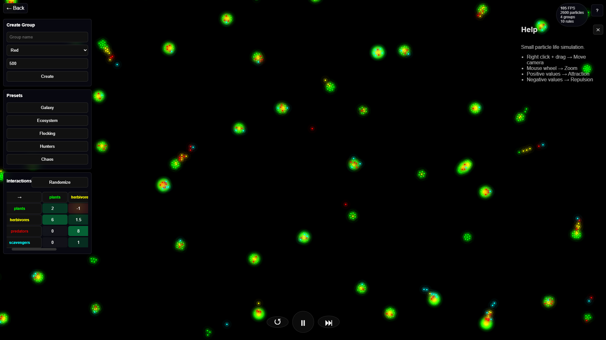

# emergexd

Simple particle simulators where repulsion and attraction occurs between particles in real time, creating complex emergent patterns and behaviors from simple rules.


### Live Demo

Project can be run by cloning the repository and opening index.html or directly through the link:

```
https://swaznil.github.io/emergexd/
```

---
## For Life01 (First attempt)

First Porject in EmergexD series

#### Features

- Real time particle simulation
- Pan camera controls + Zoom
- Built-in presets
- Mutiple custom particle groups supported
- Customizable interaction matrix
- Reset, Pause and Step controls
- Adjustable attraction/repulsion
- Spatial grid optimization for better performance
- Completely 2D
- GPU rendering using PixiJS

#### Screenshots




#### Controls

| Control | Action |
|---|---|
| Right click + drag | Move Camera |
| Mouse wheel | Zoom |
| Positive values | Attraction |
| Negative values | Repulsion |

#### Tech Used

- HTML 5 with canvas
- CSS
- JavaScript
- PixiJS rendering library

### Project Structure

emergexd/
│
├── index.html
├── main.js
├── style.css
├── README.md
│
├───assets/
│       Screenshot01.png
│
└── life01/
    ├── life01.html
    ├── canvas.js
    ├── preset.js
    └── style01.css

---

### Motivation

I came across a youtube video about The Three body problem and wanted to simulated to simulate something 
similar, but with many bodies (in this case, particles). 
While developing a gravity simualtor I was not satisfied with using only attractice force and I experimented 
with negative gravity (in this case repulsion) and added different partices with different properties. 
Doing so and further researching this topic, I cam across the niche some particlelife simualtor websites 
and I was inspired by it. 
I wanted something similar and here I am creating it as the first project in my EmergexD series, made for Horizons Hackclub.

# AI Usage

ChatGPT was used for:
- Debugging JS code with general guidacnce
- Discussing simulation logics
- Performance Improvements and code cleanup 

All project decesions, implementaion choices and over third quarter of coding was done by me.

---

More experiments will be added over time.
Made for Horizons, Hackclub.