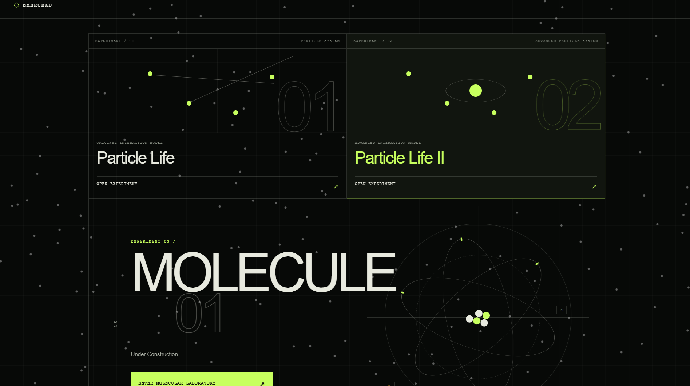
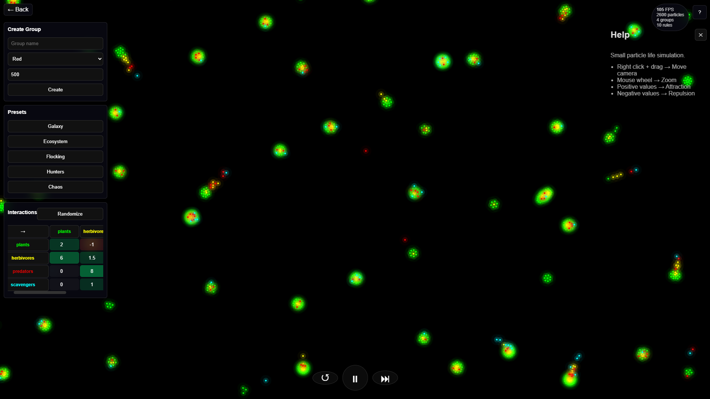
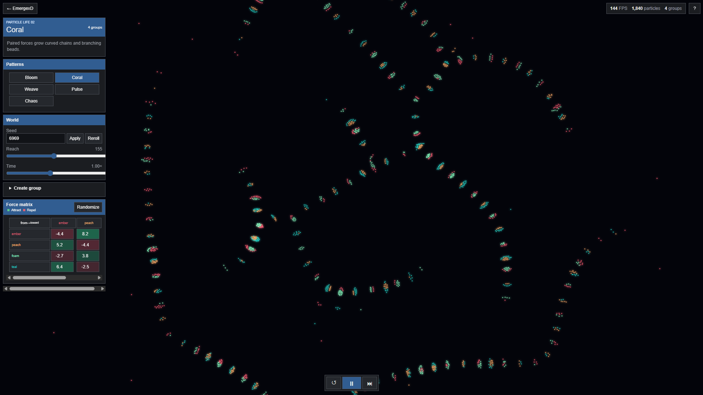

# emergexd

EmergexD is a simple particle simulators where repulsion and attraction occurs between particles in real time, creating complex emergent patterns and behaviors from simple rules.

---

### Live Demo

Project can be viewed through the link:

```
https://emergexd.vercel.app/
```

or

```
https://swaznil.github.io/emergexd/
```

---
## For Life01 (First attempt)

First Porject in EmergexD series

#### Features

- Real time particle simulation
- Pan camera controls + Zoom
- Built-in presets
- Mutiple custom particle groups supported
- Customizable interaction matrix
- Reset, Pause and Step controls
- Adjustable attraction/repulsion
- Spatial grid optimization for better performance
- Completely 2D
- GPU rendering using PixiJS

---

## For Life02 (Second Attempt) 

#### Improvements and new features:

- New distinct presets that spawn differently
- Ability to adjust interaction radius and simulation speed
- Interaction takes place at fixed intervals
- Better performance
- Smoother Camera movement due to PixiJS
- The reset option creates the same preset again
- Simulations are based on the seed, which means they produce the same result with the same seed.

#### Screenshots







---

### Controls

| Control | Action |
|---------|--------|
| Right click + drag | Move Camera |
| Mouse wheel | Zoom |
| Positive values | Attraction |
| Negative values | Repulsion |

---

### Tech Stack

- HTML, CSS, JavaScript (Vanilla)
- PixiJS rendering library

### How It Works

The simulation is governed by the simple interaction rules for different particle groups. Interaction forces are applied to particle, causing particles to moveand form emergent patterns over time.

Each particle is a part of some group having distinct attraction/repulsion properties towards other groups. All neighboring particles are examined with the help of spatial grid optimization.

The simulation is rendered using GPU-accelerated PixiJS rendering engine.

---

### Project Structure

```text
emergexd/
├── assets/          # Images
├── life01/          # Particle life v1
├── life02/          # Particle life v2
├── gravity01/       # Gravity experiment
├── index.html
├── main.js
├── style.css
└── README.md
```

---

### Motivation

I discovered an interesting youtube video on “The three body problem” and thought of doing something similar but involving more than three bodies (in this case: many particles). 
While working on a gravity simulator, I didn’t like the idea of just relying on attractive forces and decided to work on negative gravity forces (repulsive forces) as well as introduce different particles with unique properties.
This is how I discovered that there are some niche ParticleLife simulation sites out there, which really inspired me.

I thought of doing something similar and hence here’s my first two project in the EmergexD series.

### AI Usage

ChatGPT was used for:
- Debugging JS code with general guidacnce
- Discussing and learning simulation logics
- For drawing shapes on landing page UI
- Performance Improvements and code cleanup 

All project decisions, implementation choices and most of the coding were done by me.

---

